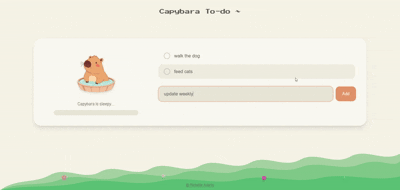

# Capybara To-Do ˚˖𓍢ִ໋`🌿:✧˚

a cute, gamified to-do app built with React + TypeScript



## What it does

- lets you add, complete, and delete tasks
- saves your tasks in `localStorage` so they persist after refresh
- shows a capybara and happiness meter that react as you complete tasks
- unlocks a "Fresh start" reset button when all tasks are done

## How it works 

- app state is managed in `src/pages/Index.tsx`
- tasks are stored in an array and synced to `localStorage` (`capybara-tasks`)
- completing a task triggers small UI animations (capybara bounce + meter pulse)

## Run locally

```sh
npm install
npm run dev
```

OR visit the live version at: https://capybara-to-do.vercel.app/